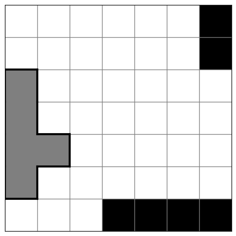
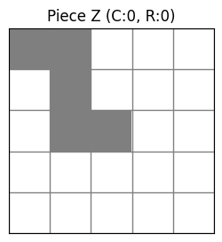

# Solving A-Puzzle-A-Day by DragonFjord with Reinforcement Learning

## Intro

[Here's the puzzle](https://www.dragonfjord.com/product/a-puzzle-a-day/).


The idea is to arrange the irregular group of pentominos on the grid to reveal only the current month and date.

This is an [exact cover](https://en.wikipedia.org/wiki/Exact_cover) problem, closely related to its [pentominos instance](https://en.wikipedia.org/wiki/Exact_cover#Pentomino_tiling).

[Here's a reddit post](https://www.reddit.com/r/puzzles/comments/t9uejy/analysis_of_a_puzzle_a_day/) about using [Knuth's Algorithm X](https://en.wikipedia.org/wiki/Knuth%27s_Algorithm_X) to brute force it.

Let's see what we can do with RL.

I'll use ~~deep Q learning~~ masked PPO via sb3 with a custom gymnasium environment

## Environment

Environment is defined here: [apad_env.py](apad_env.py).

[apad_env_validation.ipynb](apad_env_validation.ipynb) contains sanity checks (e.g. same board cell is not allowed to be occupied by two pieces).

Sample board state



Each piece has a bool chirality state and 4 rotation states



## RL Strategy

Place random moves, mask invalid moves from the action space, and train with Masked PPO.

Training is done in [apad_MPPO_train.ipynb](apad_MPPO_train.ipynb).

```
model = MaskablePPO(
    "MlpPolicy",
    env,
)
```

Rewards: experimenting with rewards. Currently using pseudo-sparce. +1 win, -.1 for losing early, +0.01 for valid piece placement.

## Notes

Highlights of the development history:
- Earliest attempts did not specify a date constraint---any two open cells were considered a win. Didn't spend too long in this mode, but were consistently getting 7/8 or maybe 8/8. I think model would stumble on a solution, get massively rewarded for it, and not learn anything new. Rather than fix this, just moved on to the real environment, where a date is specificied.
    - Back in the no-date-constraint days, a bug in PPO for envs with large action spaces leads to policy probility sum not being normalized, called a Simplex constraint violation. Turning off all validations leads to solving the env in ~15k steps. Fixing just the bug in torch leads to solving the env in 20k steps about 50% of the time, and getting stuck at 7/8 pieces placed the other 50% of the time.
- Quickly moved away from DQN to PPO. Was having no luck.
- Exiting early when the game is bricked (`has_islands()`) was huge. It's the only human "exploit" I know of.
- Moving from PPO to Masked PPO was another big step. Was spending a lot of time on invalid moves and meant I had to worry about the reward structure for invalid moves.
- Env now accepts a month and or day or neither to constrain solutions.

## Setup

### Environment

Create the conda environment from `environment.yml`:

```bash
conda env create -f environment.yml
conda activate rl
```

Or manually:

```bash
conda create --name rl python=3.10
conda activate rl
conda install pytorch torchvision torchaudio -c pytorch
conda install swig
pip install stable-baselines3 sb3-contrib gymnasium[all] tensorboard jupyter matplotlib scipy numpy pandas
```

### Install Package

Install the project in editable mode for clean imports:

```bash
pip install -e .
```

### Pre-commit Hooks

Set up pre-commit hooks for automatic code quality checks:

```bash
pre-commit install
```

This will run on every commit:
- **ruff** - Fast linting and formatting (Python files)
- **nbqa + ruff** - Linting for notebooks
- **pytest** - Run test suite (excluding slow tests)

To run manually on all files:
```bash
pre-commit run --all-files
```

To skip hooks for a specific commit:
```bash
git commit --no-verify
```

## Testing

Run the test suite:

```bash
pytest                    # Run all tests
pytest -v                 # Verbose output
pytest -m "not slow"      # Skip slow tests
pytest test_apad_env.py::TestBasicEnvironment  # Run specific test class
```

The test suite (`test_apad_env.py`) validates:
- Environment initialization and grid structure
- Piece placement, rotation, and chirality
- Overlap detection and reset functionality
- Date constraint handling
- Island detection for unwinnable states
- Action masking correctness
- Full gameplay mechanics
