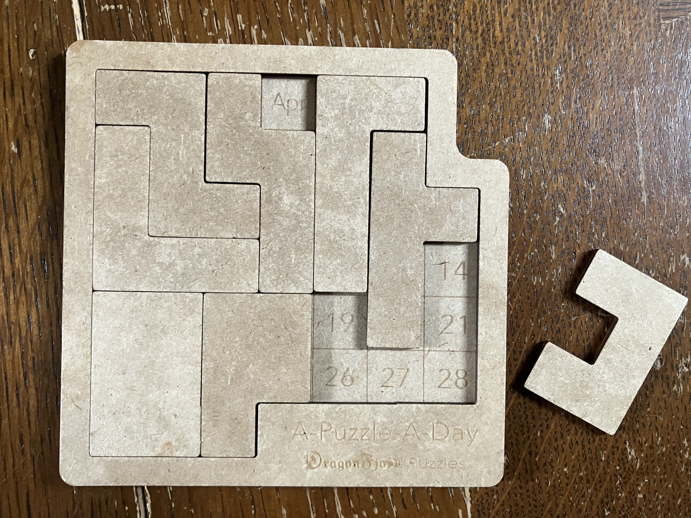
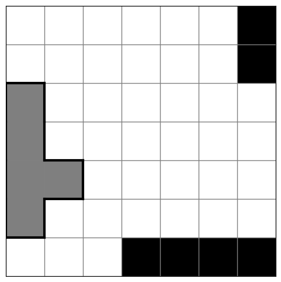
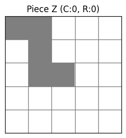

# Solving A-Puzzle-A-Day by DragonFjord with Reinforcement Learning

## Intro

[Here's the puzzle](https://www.dragonfjord.com/product/a-puzzle-a-day/).



The idea is to arrange the irregular group of pentominos on the grid to reveal only the current month and date.

This is an [exact cover](https://en.wikipedia.org/wiki/Exact_cover) problem, closely related to its [pentominos instance](https://en.wikipedia.org/wiki/Exact_cover#Pentomino_tiling).

[Here's a reddit post](https://www.reddit.com/r/puzzles/comments/t9uejy/analysis_of_a_puzzle_a_day/) about using [Knuth's Algorithm X](https://en.wikipedia.org/wiki/Knuth%27s_Algorithm_X) to brute force it.

Let's see what we can do with RL.

I'll use deep Q learning via sb3 with a custom gymnasium environment

## Environment

Environment is defined here: [apad_env.py](apad_env.py).

[apad_env_validation.ipynb](apad_env_validation.ipynb) contains sanity checks (e.g. same board cell is not allowed to be occupied by two pieces).

Sample board state



Each piece has a bool chirality state and 4 rotation states



## RL Strategy

Getting started, completely random moves are selected, passed to the `step` function and then checked for validity. Unsurprisingly I'm swamped by invalid moves. This will certainly hamper learning. Action-masking is a needed near-term improvement. 

Training is done in [apad_DQN_train.ipynb](apad_DQN_train.ipynb).

```
model = DQN(
    "MlpPolicy", 
    env, 
    exploration_initial_eps=1.0,    # Start with 100% random
    exploration_final_eps=0.1,      # End with 10% random  
    exploration_fraction=0.5,       # Take half of training to decay
    learning_rate=1e-3,             # Slightly higher learning rate
    verbose=1
)
```

with 50,000 timesteps, we still can't win 1% of games. I suspect that action-masking will be the most important improvement.

## Notes

- At the moment, a success/win means placing all the pieces on the board, which may not be a valid date. That's another constraint to be placed.
- The way the game is intended to be played is to choose a date and construct a solution around it. The environment is not currently structured this way.
- Reviewing the goal of this project: you enter the date, the model finds a (all) solution(s).
- The environment is currently organized to solve a simpler problem: find *any* solution, whether or not it's a valid date.
