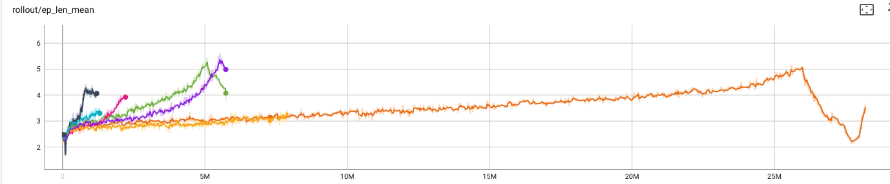

# 2025-06-29

Sparse rewards, viz only rewarding upon victory with no feedback otherwise, was really not working very well. We can get immediately progress to at least 6 successful moves by punishing for losing. Most recently, the best results in this respect have been: when you make a move that creates a eventually-game-losing island, reward it negatively, but allow the game to progress until there are no further moves.

Early game, turns 1-3:
- easy to teach not to lose immediately.
- but hard to think ahead to an eventual solution

Midgame, turns 4-6:
- Significantly reduced action space.
- Shouldn't be hard to train it to win from this point on, IF the game is winnable.

Late game, turns: 7-8:
- Often, turns 7 and 8 are literally trivial. Action space is < 10 by turn 7, often, if the game is winnable.

So I've been training in stages, lately: in easy mode, there is no solution date constraint and placement of 6 pieces is considered a win, even if islands are created in the process. At the next difficulty levels: (a) 7 pieces are required to win with no date constraint, (b) 6 pieces to win with just a month constraint, or (c) 6 pieces to win with 2just a day constraint. This hasn't worked too well.

### Brainstorming:

- An idea: First, just train it to not lose in the first three moves: end games after 3 or 4 pieces. Do use the month-date constraint. Next, sic it on the full game, with the proper repsect for what was learned in the first training. Or if we could just train on games that start 3 moves in?

- Another thought: "rapid" (exponential probably) reduction in action space size is probably a necessary condition of a loss. While the converse isn't necessarily true, we'd probably have success exploiting it. So we'd pass the size of the action space as an observation and/or punish for a reduction of the action space by more than a factor of 2 in the first 3 moves. I just worry this would train it to be bad at (hypothetical, but probably real) games that have narrow action-spaces through the whole game.

- Latest thinking: the "avoiding loss" reward structure may be counterproductive. We so reliably get to 6/8, but with no concern for whether the 6/8 is a winning state. I'm upping entropy coefficient in order to hopefully thoroughly explore the early game space.

# 2025-07-01


```python
env = APADEnv()
model = None
model = MaskablePPO(
    "MlpPolicy",
    env,
    tensorboard_log="./maskable_ppo_logs_15/",
    ent_coef= 0.2,
    #learning_rate=0.003,
    verbose=1,
)

total_timesteps = 800000
checkpoint_interval = 100000
for i in range(0, total_timesteps, checkpoint_interval):
    remaining_steps = min(checkpoint_interval, total_timesteps - i)
    if i == 0:
        model.learn(total_timesteps=remaining_steps, reset_num_timesteps=True, callback=[TimerCallback(),GradNormCallback()])
    else:
        progress = i / total_timesteps
        model.ent_coef = 0.01 + 0.19 * (1 - progress)
        model.learn(total_timesteps=remaining_steps, reset_num_timesteps=False, callback=[TimerCallback(),GradNormCallback()])
    model.save(f"mppo_model_v1")

# realized I wanted to keep going
model.load("mppo_model_v1")
model.learn(total_timesteps=400000, reset_num_timesteps=False, callback=[TimerCallback(),GradNormCallback()])
```


In this big training session, I started with entropy coefficient 0.2, decreased it to 0.01 by increments every 100k timesteps until 800k. But then (!) at this point the training levels off. I do not understand it. Why so suddenly at 0.01? Coincidence or bug? Note how learning was skyrocketing right at that point, between 600k and 800k.

New plan: start the same, but bottom out the entropy coefficient at 0.03, which is about where it was when learning was going so well? 0.01 + 0.19 * (1-72/80) ~ 0.03. And train for longer.

# 2025-07-08

I looked more carefully at v1's training metrics and here's what claude had to say:

- ep_len_mean - Average episode length; shows how long episodes are lasting
- ep_rew_mean - Average episode reward; direct measure of agent performance
- approx_kl - KL divergence between old/new policies; measures how much policy changes per update
- entropy_loss - Policy entropy regularization term; measures how random/decisive the policy is (more negative = more random)
- loss - Total policy loss; overall learning signal (negative good, moving toward 0 means refining)
- policy_gradient_loss - Gradient magnitude for policy updates; measures how much the policy "wants" to change
- fps - Training speed; episodes collected per second

**Key pattern from Training #1 breakthrough**: approx_kl dropped (policy stabilized), entropy_loss spiked toward 0 (became decisive), policy_gradient_loss jumped (major strategy shift), then all flattened as agent converged to new strategy.

# 2025-07-10

Another attempt (v5) with something likelearning 0.0004, ent 0.18->0.025, 5M timesteps (going very fast now with vectorized envs). We were still rising when we ended. Got to 5 pieces placed. This makes me think that we need to spend more time in the lower entropy region at the end. So switched to a negative exponential, `-0.1 + 0.3*exp(-1*progress)` which drops from 0.2 to 0.01, but spends more time at higher entropy. Hm maybe next we try linear drop for the first 75% of the training and then holds at its 0.25.

And I've been tweaking rewards: I've bumped up the has islands punishment to -0.1 for the first three pieces (0 otherwise). Good move is still +0.01.

An observation with v5: unlike in any other training, explained_variance skyrocketed along with the learning spike. This is apparently measuring how well the value function correctly predicts the reward:
`1 - Var(actual_returns - predicted_values) / Var(actual_returns)`. Even when v3 was learning fast, its explained variance was crashing. Also with v5, clip fraction crashed.

# 2025-07-25

Tried an exponential ent drop with 30M timesteps. No luck. Still capped at 5/8, basically.



Regardless of my entropy coef schedule or timesteps, I get the same trajectory.

So, two new ideas: (1) stay and train on a single board for N timesteps before moving on. The very vague idea would be that it will get to know a single board and maybe learn something from it? And that jumping around to lots of boards would be too whiplashy? And (2) [Andy Jones](https://andyljones.com/posts/rl-debugging.html) says that large batch size is generally good? He cites [An Empirical Model of Large-Batch Training](https://arxiv.org/abs/1812.06162) and says: 

- Pong: ~1k batch size
- Space Invaders: ~10k batch size
- 1v1 Dota: ~100k batch size

Just intuitively, I feel like I'm way closer to Pong than Dota, so maybe I'll try 1k?

Results from (1) no good, but could keep training:


Maybe next I'll try training longer while also increasing batch size. Claude suggests that maybe increasing `n_steps` might also be important for PPO specifically? This is the number of steps per policy update. Default `n_steps` is 2048, so with batch sizes of 1000, we're only doing 2 gradient steps per policy update. The idea is that maybe this should be bigger. OK fine.

Anyway, v1.2 is batch size 1000 with default n_steps, 2048, times our 8 agents --> ~16 gradient steps per policy update. Fine?

### Brainstorming, Misc Thoughts

**gamma** Default is 0.99. Higher number means early moves in a game are rewarded more. Lower number means early moves are rewarded less than later moves. *Are* early moves more valuable than late? It's true the early game is hard and late game is easier, but does that mean we should reward early moves more? IDK. Hunch says I should bump it up.

**More Masking** So, sort of as training wheels, what if creating islands was illegal? Given that I haven't solved the problem yet, this seems like a no-brainer.

**Training Time** Seems like regardless of n_timesteps (which correlates to training time) we reach the same convergence. I assume this is due to the entropy coefficient schedule? We used to train really fast and I miss it. It's just so frustrating cutting a training off before it's definitely plateaued.


